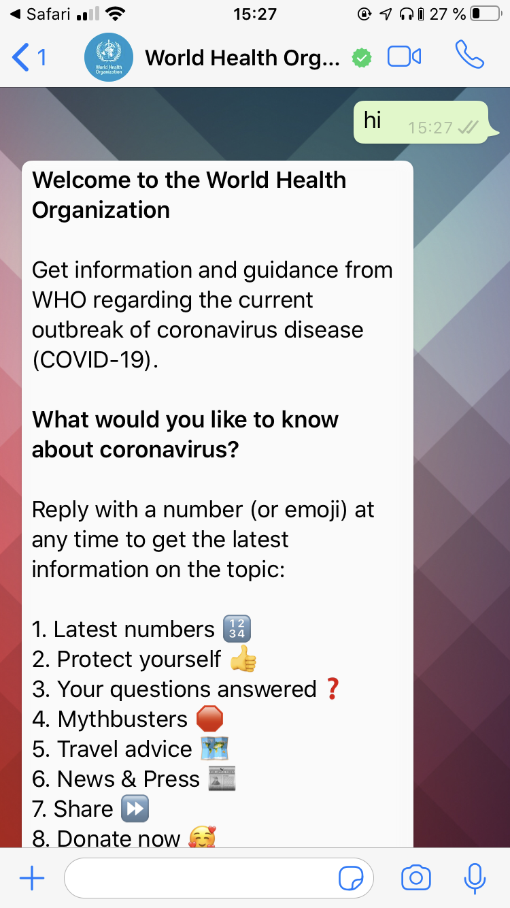

# Introduction

Using the CSML Studio, you can connect and deploy your chatbot on a number of communication channels. Each channel has its own set of limitations and features, so when developing a chatbot you must always keep in mind how your end users will be using your chatbot. Vocal chatbots are not consumed the same way as textual chatbot, so it sometimes makes sense to design an entirely separate user experience for channel.

### Default component behavior

CSML can not compensate for limitations in each third-party channel. Instead, it provides a universal way to describe conversational components and an adaptor will try to match with what is available on that channel.



In most cases, CSML will try to find a sensible default behavior for each component on each channel. For instance, some channels can not display actual buttons so they will be displayed as plain text: in that case, a good practice is to place buttons in an ordered list and accept the buttons number as a trigger for that button.

### Differentiating between channels

If you plan to use the same chatbot on multiple channels at the same time, there may be times where you need your chatbot to have a different behavior based on the type of channel: changing a text, displaying a static image instead of a video, altering the buttons...

```cpp
do channel_type = _metadata._channel.type

// whatsapp can not display clickable buttons
// so we must provide a number to select instead
if (channel_type == "whatsapp-messagebird") say Button("1 - Pick me!")
else if (channel_type == "webapp") say Button("Pick me!")
```


