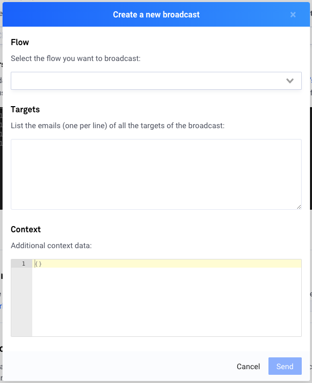

# Configuration

You can find similar configuration settings between [Messenger](../messenger/configuration.md) and Workchat channels. However, Workchat being a professional, internal-only communication channel, there are some additional options you can play with.

## Metadata

This is not really a configuration option, but know that the `_metadata` object inside your flows will have slightly different information about your user compared to what is available on Messenger. On Workplace Chat, you can directly access a user's `first_name`, `last_name` and `email` in the conversation's metadata.


There is also an `id` field, however this is not the user's real Workplace ID but is called an [app-scoped user ID](https://developers.facebook.com/docs/workplace/third-party-apps/development#user-ids). It can not be related back to the user's actual ID.


## Broadcast

The Broadcast feature allows you to trigger any flow for any given user or list of users. To use the broadcast feature, click on **Send broadcast** to open a configuration popup.

* Under **Flow**, select the flow you want to trigger
* Under **Targets**, list the emails \(one per line\) you want to receive the broadcast
* Under **Context**, you can optionally add any additional context that you want to set in the `_metadata` object for this broadcast

Once you hit **Send**, the broadcast will be sent immediately.


**For a very large number of targets, consider splitting into smaller sets.**

If the broadcast were to fail sending for any reason, you would not want to retry all the users again, as some may receive the broadcast twice!


